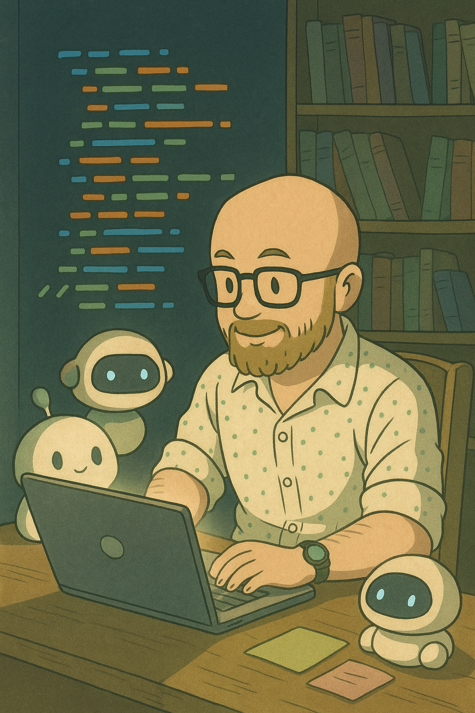

# Krystian’s Portfolio Website

**Welcome to my digital corner of the internet!**
This [website](https://www.sudokrystian.com) was handcrafted by me — Krystian — as a portfolio and personal playground to showcase my work, creativity, and the tech I love. Whether you’re here to hire, collaborate, or just poke around out of curiosity, you’re in the right place.

---

## 🚀 About This Project

* **Designed and built by me** from scratch using React, TypeScript, Vite, modern JS tools, and a healthy dose of stubborn curiosity.
* **Portfolio-first:** The site is a central hub to display my projects, skills, and professional experience.
* **Interactive and playful:** You’ll find interactive elements, smooth UI, and even a few games (because why not?).
* **Images:** Some photos are from my own adventures, while a few (especially the quirky or Ghibli-inspired ones) are generated with AI — because, well, I’m a tech geek at heart.

---

## 🛠️ Technologies Used

* **Frontend:** React + TypeScript, Vite, SCSS/Sass, modern ES modules
* **Backend:** I’ve built robust APIs and high-performance systems using Python, C++, Java, Node.js, and more — you can see my backend-heavy projects and experience detailed on this site.
* **CI/CD:** Automated deployment with GitHub Actions and Firebase Hosting
* **AI:** I experiment with generative AI for images and creative coding — some results are sprinkled throughout this site.

---

## 👨‍🔬 My Experience

* **CERN alumni:** I’ve spent years at CERN, working on challenging scientific computing projects, algorithms, and big data systems — pushing the limits of what’s possible at the world’s largest physics lab.
* **Backend aficionado:** I build things that scale, stay online, and don’t crash under load.
* **Polyglot developer:** My tech stack is a grab-bag of whatever gets the job done best: Python, Java, C++, TypeScript, Node, React, Unity, and more.

---

## 🎮 Why Does This Site Have Games?

Because life is more fun when you’re not just reading résumés.
Plus, building games sharpens my skills in algorithms, UX, and high-performance frontend work.

---

## 🤝 Want to Work Together?

If you’re looking for a creative, reliable, and technically broad engineer for your team or project —
**Let’s talk!**
Check out my [CV](public/documents/CV.pdf), browse my [projects](#), or reach out via the contact form.

---

## 📸 Credits

* **All code:** Written by me
* **Photos:** Mostly mine, some generated by AI (Studio Ghibli and cyberpunk vibes included!)
* **Icons:** [FontAwesome](https://fontawesome.com/)

---

**Thanks for visiting my site. Hope you enjoy it as much as I enjoyed building it!**

 

  

---

*Made with passion, whiskey, and a dash of AI magic.*
**— Krystian**

